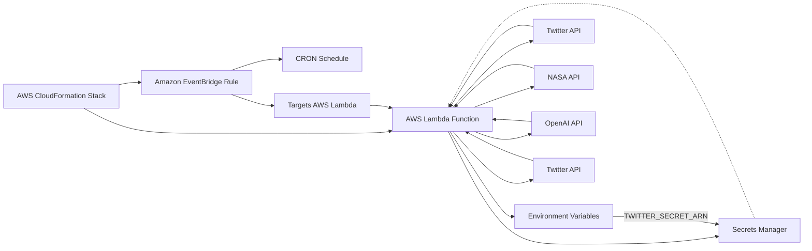
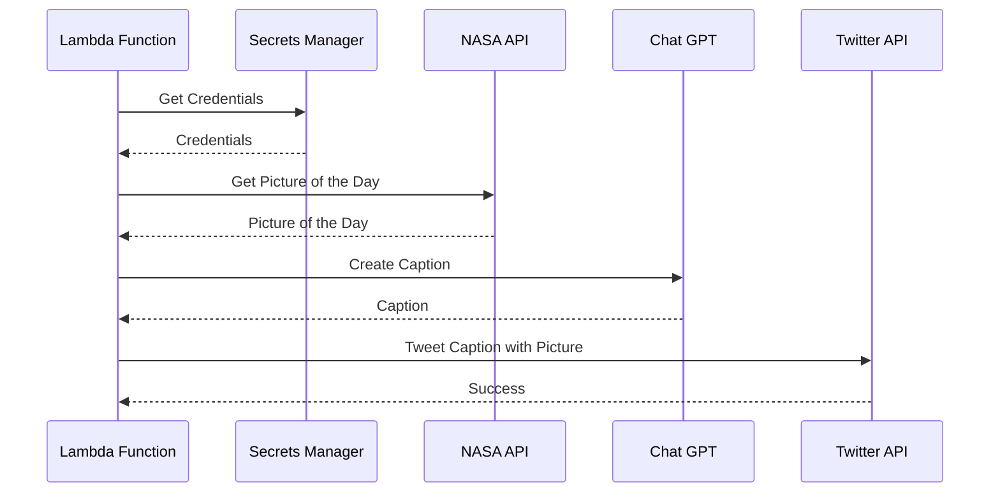

## SonOfAstraeusCdkStack

This AWS CDK stack deploys a Twitter bot that runs on a schedule using Amazon EventBridge. The bot
retrieves Twitter API keys and access tokens from AWS Secrets Manager and uses them to interact with
the Twitter API.

## Prerequisites

Before deploying this stack, ensure that you have:

- An AWS account with appropriate permissions
- AWS CLI installed and configured
- Node.js and npm installed
- Twitter API keys and access tokens
- OpenAi API keys
- Nasa API keys

## Getting Twitter API Tokens

To use the Twitter API in your application, you need to obtain API keys and access tokens from
Twitter's developer platform. Here are the steps to get Twitter API tokens:

1. Apply for a Twitter developer account by going to the
   [Twitter Developer Platform](https://developer.twitter.com/en) and clicking the "Apply" button.
   Follow the steps to complete your application. You may need to provide additional information
   about yourself and your intended use of the API.
2. Go to the [Twitter Developer Dashboard](https://developer.twitter.com/en/dashboard) and create a
   new app. Follow the steps to enter basic information about your app, such as the name and
   description.
3. Once you've created your app, navigate to the "Keys and tokens" tab. Here you will find your API
   keys and access tokens.
4. Copy your API key and API secret key to a safe place, as you will need them to authenticate your
   application with the Twitter API. You will also need to generate an access token and access token
   secret. To do this, click the "Generate" button under the "Access token & access token secret"
   section.

That's it! You now have the API keys and access tokens you need to use the Twitter API in your
application. Keep in mind that these tokens are sensitive and should be kept secure. It's
recommended to store them in a secure location, such as AWS Secrets Manager, rather than hardcoding
them in your application code.

# How to Get NASA API Keys

To use NASA's APIs, you need to obtain an API key. Here are the steps to get your API key:

1. Go to https://api.nasa.gov/ and click on the "Generate API Key" button located in the top right
   corner of the page.

2. Sign up for an account by providing your name, email address, and a password. You can also sign
   up using your Google, Facebook, or GitHub account.

3. After signing up, you will receive a verification email. Click on the link in the email to verify
   your account.

4. Once you've verified your account, log in to the NASA API portal using your email address and
   password.

5. In the NASA API portal, you will see your API key displayed under "My API Keys". If you don't see
   any API keys listed, click on the "Generate API Key" button to create one.

6. Copy the API key and use it in your API requests to NASA's APIs.

**Note:** Some NASA APIs have rate limits that apply to API key usage, so be sure to read the
documentation for each API you use to ensure you are using your key correctly. Also, keep your API
key confidential and do not share it with anyone else.

## Installation

To deploy the stack, follow these steps:

1. Clone the repository
2. Install dependencies by running `npm install`
3. Build the Lambda function by running `npm run build`
4. Deploy the stack to AWS by running `cdk deploy`

## Usage

Once the stack is deployed, the Twitter bot will run on the schedule specified in the `eventRule`
object (currently set to run every day at 12:00 PM). The bot retrieves Twitter API keys and access
tokens from the `twitter-api-keys` secret stored in AWS Secrets Manager.

## Architecture

The following diagrams show the high-level architecture of the system:

## Code Overview

The `SonOfAstraeusCdkStack` class extends the `cdk.Stack` class and defines the resources that will
be created in AWS. The class constructor takes in the `scope`, `id`, and `props` parameters. The
`props` parameter is an object of type `SonOfAstraeusCdkStackProps` that contains the AWS account
ID, region, and Twitter API keys and access tokens.

The stack creates an AWS Secrets Manager secret for storing the Twitter API keys and access tokens.
The `twitterSecret` object is an instance of the `secretsmanager.Secret` class. The
`generateSecretString` property of the `Secret` object generates a new secret string and sets the
value of the `password` key to the JSON stringified value of the `props.secret` object. The
`twitterSecret` object is granted read access by the Lambda function `twitterBotFunction`.

The `twitterBotFunction` object is an instance of the `NodejsFunction` class that creates a new AWS
Lambda function for the Twitter bot. The `TWITTER_SECRET_ARN` environment variable is set to the ARN
of the `twitterSecret` object. The `twitterBotFunction` object is added as a target for the
`eventRule` object.

The `eventRule` object is an instance of the `events.Rule` class that creates a new Amazon
EventBridge rule. The `schedule` property of the `Rule` object sets the schedule for the rule to
trigger the Lambda function. The `LambdaFunction` target is added to the `eventRule` object.
